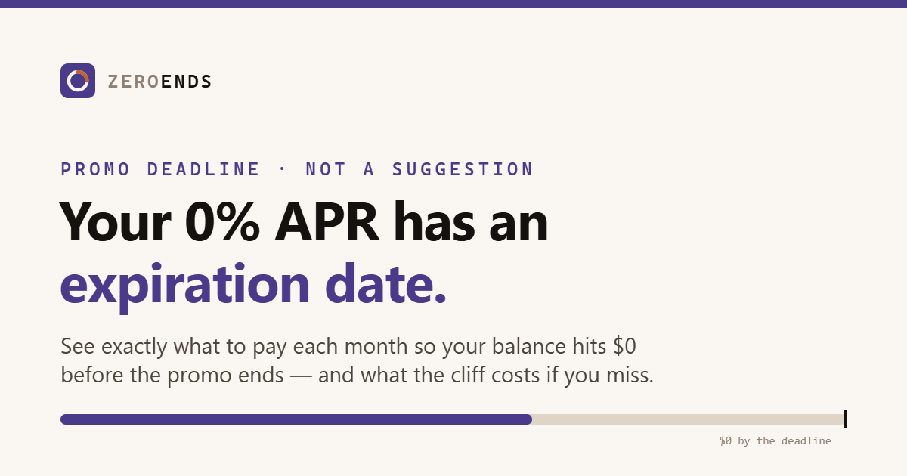

# ZeroEnds

**Live tool: https://ababa1326.github.io/zeroends/**

A 0% intro APR is temporary. ZeroEnds tells you exactly what to pay each month so your
balance reaches **$0 before the promo ends**, and shows what the interest cliff costs if
your current payment pace leaves a balance behind.

## What it does

- Enter your current balance and either the exact **promo end date** or your **account
  opening date plus promo length**
- See the fixed monthly payment needed to reach $0 before the deadline
- Check whether your current monthly payment is on pace and estimate the first-year
  interest on any leftover balance
- Flag deferred-interest financing, where even $1 remaining can trigger retroactive interest
- Download a one-time calendar reminder (.ics) for 30 days before the promo ends

## Privacy

Everything runs in your browser. No accounts, no server, no analytics, no connection
to your bank — the numbers you type never leave the page.

## Tech

One self-contained `index.html`. Vanilla JavaScript, zero dependencies, no build step.
Hosted free on GitHub Pages.

## Related

[ReportsLow](https://github.com/ababa1326/reportslow) — a free statement-date calculator
that tells you what to pay before your credit card balance is reported.

---

*Educational tool, not financial advice. Confirm your promo end date, regular APR, and
deferred-interest terms in your card agreement or statement.*
